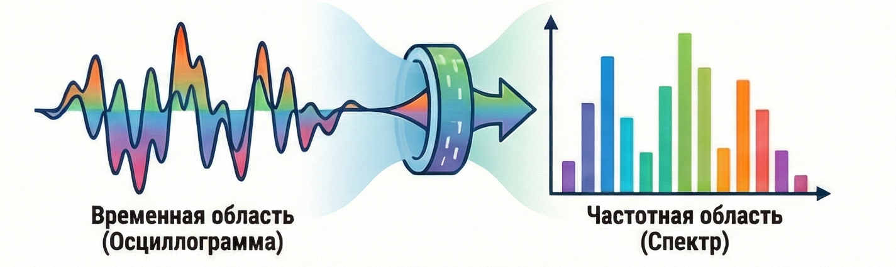
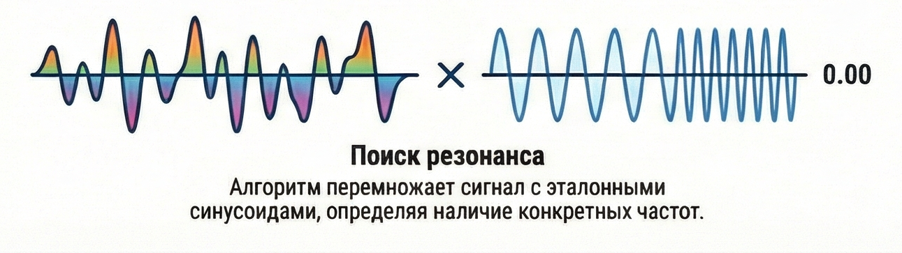
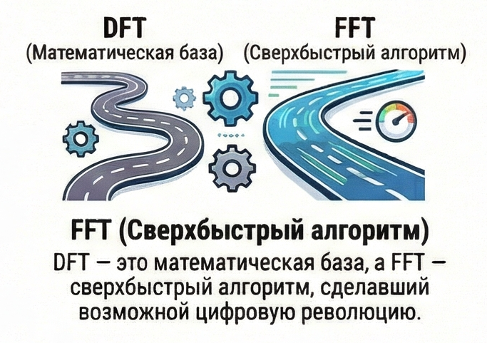
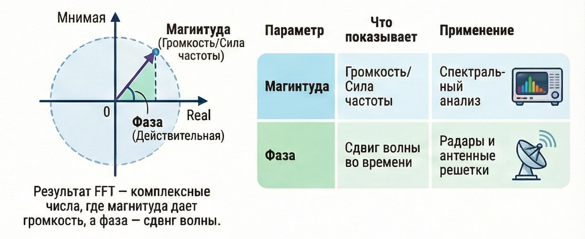
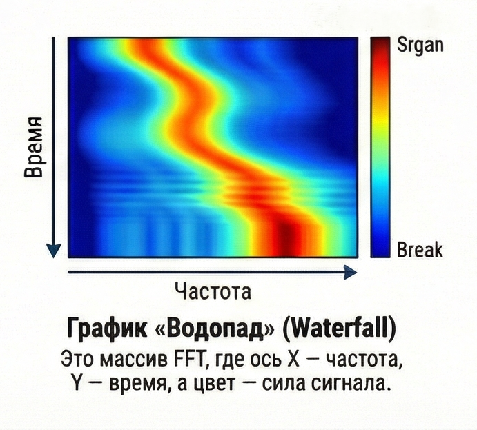

# Преобразование Фурье (DFT/FFT).
 
 Если до этого мы смотрели на сигнал как на изменение напряжения во времени (как на осциллографе), то теперь мы научимся видеть его "изнутри".
 
 ## 1. Главная идея: Всё есть сумма синусоид
 
В начале 19 века французский математик Жан-Батист Фурье сделал смелое заявление:

    Любой, даже самый сложный и угловатый периодический сигнал можно представить как сумму простых синусоид разных частот и амплитуд.
 
 Представь, что ты ешь суп.
 
 - **Временная область (Time Domain):** Ты чувствуешь общий вкус ложки супа сейчас.
 - **Частотная область (Frequency Domain):** Ты магическим образом раскладываешь этот вкус на ингредиенты: 5 грамм соли, 20 грамм картошки, 1 грамм перца.
 
 **Преобразование Фурье** — это и есть та машина, которая берет сложный сигнал (суп) и выдает список ингредиентов (частот).

 
 
 ## 2. Как это работает (на пальцах)?
 
 Представь, что у тебя есть запись сложного аккорда на пианино. Как компьютеру понять, какие ноты нажаты?
 
 Алгоритм берет твой сигнал и начинает "примерять" к нему синусоиды известных частот:
 
 1. Берет эталонную синусоиду 440 Гц ("Ля").
 2. Перемножает её с твоим сигналом.
 3. Если в твоем сигнале есть нота "Ля", результат умножения будет большим (резонанс).
 4. Если ноты "Ля" нет, результат будет около нуля.
 


 Проделав это для всех возможных частот (от 0 до 20 кГц), мы получаем **Спектр** — график, где по горизонтали частота, а по вертикали — сила этой частоты в сигнале.
 
 ## 3. DFT против FFT: В чем разница?
 
 Ты часто будешь встречать обе аббревиатуры.
 - **DFT (Discrete Fourier Transform / ДПФ):** Это само математическое действие. "Разложение дискретного сигнала на частоты".
 - **FFT (Fast Fourier Transform / БПФ):** Это **алгоритм**, хитрый способ вычислить DFT очень быстро.

<p align="center">
  
</p>
 
 ### Почему это важно?

 Если бы мы считали DFT "в лоб", твоему компьютеру понадобились бы минуты, чтобы проанализировать секунду звука. FFT делает это за миллисекунды. Именно алгоритм FFT (изобретенный в 1965 году Кули и Тьюки) сделал возможным цифровую революцию.
 
 ## 4. Для тебя как исследователя (Python + SDR)
 
 В библиотеке numpy это делается одной строчкой:

```Python
 spectrum = np.fft.fft(signal)
```

 Но тут есть нюанс. Функция `fft` возвращает **комплексные числа** ($a + ib$).
 - **Магнитуда (Magnitude):** $\sqrt{a^2 + b^2}$ — показывает громкость частоты. Это то, что мы обычно рисуем на графиках.
 - **Фаза (Phase):** $\arctan(b/a)$ — показывает сдвиг волны во времени. Часто игнорируется в простых анализаторах, но критически важна для фазированных антенных решеток и радаров.

  
 
 ## 5. Что мы видим в SDR?

 Когда ты запускаешь программу для SDR-приемника, ты видишь **"Водопад"** (Waterfall).
 
 Это просто много-много преобразований Фурье, поставленных друг на друга:

 - Ось X: Частота (результат FFT).
 - Ось Y: Время (прошлые результаты FFT уезжают вниз).
 - Цвет: Сила сигнала (Магнитуда).

 <p align="center">
  
</p>