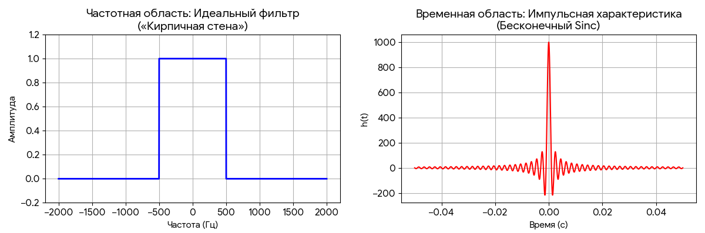
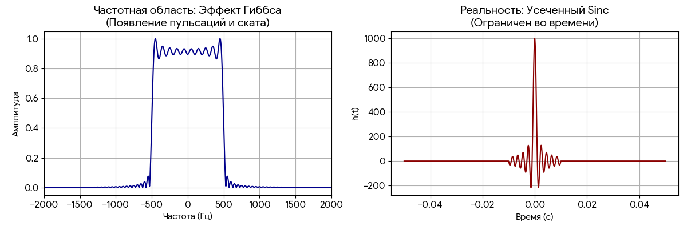
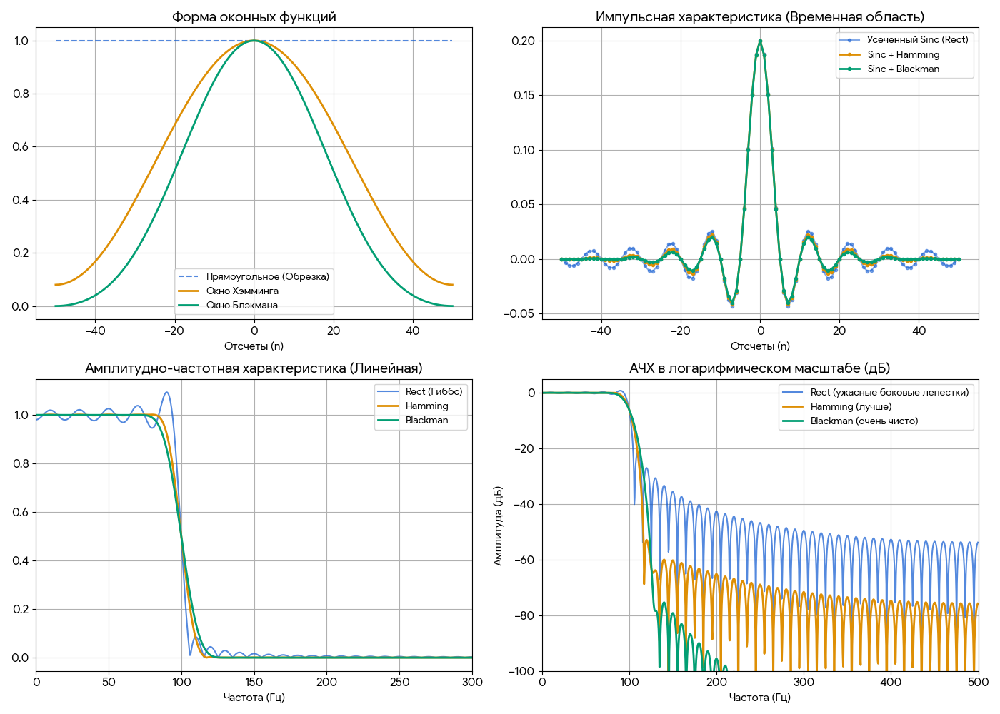

# Оконные функции (Windowing)

**Оконные функции** — это «сердце» классического метода проектирования FIR-фильтров (КИХ-фильтров).

Давай разберем, как это работает «под капотом», потому что это фундаментальный момент в ЦОС.

### Метод окна при создании фильтра

Когда мы хотим создать идеальный фильтр (например, Low-Pass, который пропускает всё до 1000 Гц и полностью обрезает всё, что выше), мы сталкиваемся с математическим парадоксом:
1. **Идеальный фильтр в частотной области** выглядит как «кирпичная стена» (прямоугольник).
2. **Временная область:** Если мы переведем этот прямоугольник обратно во время (с помощью обратного БПФ), мы получим функцию Sinc:

$$
h(n) = \text{sinc}(x) = \frac{\sin(\pi x)}{\pi x}
$$

3. **Проблема**: Эта функция бесконечна в обе стороны. Чтобы сделать реальный цифровой фильтр, нам нужно её «обрезать» (сделать импульсную характеристику конечной — Finite Impulse Response).

### Что происходит при обрезке?

Если мы просто обрезаем Sinc (это эквивалентно умножению на **прямоугольное окно**), на частотной характеристике фильтра появляются сильные пульсации. Это называется **эффектом Гиббса**. Твой фильтр будет «звенеть» и плохо подавлять частоты вне полосы пропускания.

### Как здесь помогают окна (Hamming, Blackman и др.)?

Вместо того чтобы резко обрезать Sinc, мы плавно умножаем его коэффициенты на оконную функцию.
- **Окно «сглаживает» резкие края** импульсной характеристики.
- В результате **пульсации исчезают**, и фильтр работает гораздо чище.

### Два сценария использования окон

Важно не путать, где именно мы применяем окно:
1. **Для спектрального анализа (FFT):*** Мы умножаем **входящий сигнал** на окно, чтобы увидеть чистый спектр на экране.
2. **Для фильтрации (FIR):** Мы умножаем **коэффициенты фильтра** на окно один раз при его создании. После этого фильтр просто работает как математическая формула (свертка), «вырезая» ненужное.