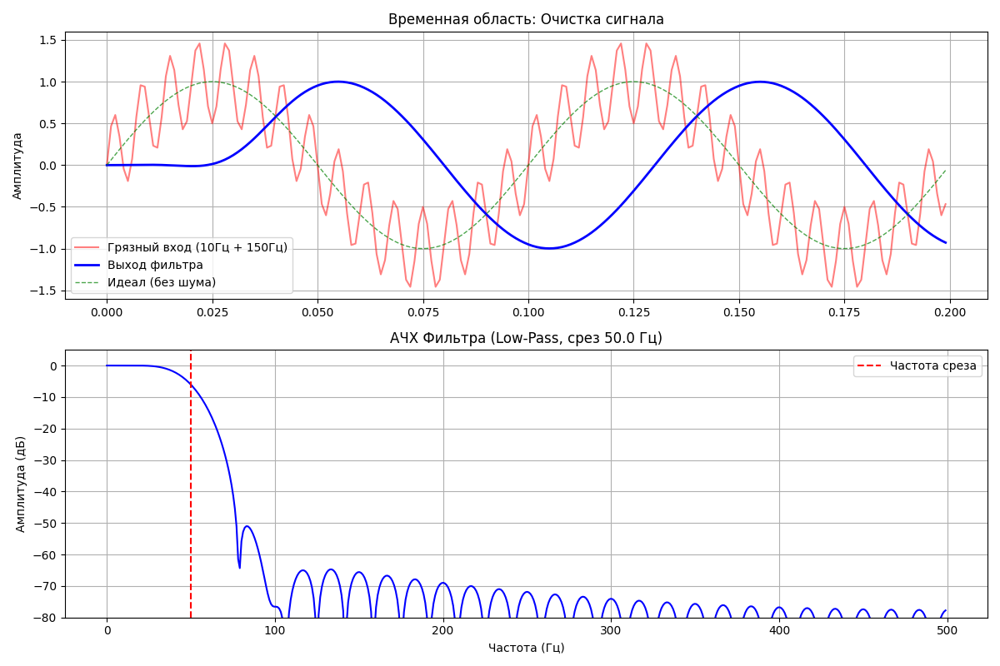

# FIR-фильтр (КИХ-фильтр)

Переходим к практике! Теперь мы создадим настоящий **FIR-фильтр (КИХ-фильтр)**, используя библиотеку `scipy`. Это именно то, что происходит внутри SDR-программ, когда ты сужаешь полосу приема.

Мы воспользуемся методом **оконного проектирования**, который мы обсуждали ранее.

## 1. Создаем зашумленный сигнал

Для начала нам нужен «пациент»: полезный сигнал (низкая частота) и шум (высокая частота).

#### Python
```Python
import numpy as np
import matplotlib.pyplot as plt
from scipy.signal import firwin, lfilter, freqz

# --- 1. Подготовка сигнала ---
fs = 1000               # Частота дискретизации (1000 Гц)
T = 0.2                 # Длительность сигнала (секунды)
t = np.linspace(0, T, int(fs * T), endpoint=False)

# Полезный сигнал: 10 Гц
sig_clean = np.sin(2 * np.pi * 10 * t)

# Помеха (Шум): 150 Гц (довольно сильная, 50% от полезного)
noise = 0.5 * np.sin(2 * np.pi * 150 * t)

# Итоговый "грязный" сигнал с эфира
sig_noisy = sig_clean + noise
```

## 2. Проектируем фильтр

Мы хотим оставить всё, что ниже 50 Гц, и убрать всё, что выше. Для этого нам нужно рассчитать коэффициенты $h[n]$.

Функция `firwin` делает именно то, что мы разбирали: берет функцию **Sinc** и умножает её на **окно** (по умолчанию — окно Хэмминга).

#### Python
```Python
# --- 2. Проектирование фильтра (Digital Filter Design) ---
# Мы хотим "убить" всё, что выше 50 Гц.
cutoff_hz = 50.0       # Частота среза
numtaps = 61           # Количество коэффициентов (порядок фильтра + 1)

# Создаем коэффициенты фильтра (импульсную характеристику h)
# Используем окно Хэмминга (по умолчанию в firwin)
h = firwin(numtaps, cutoff_hz, fs=fs)
```

    **Важно:** Чем больше `numtaps`, тем круче будет срез фильтра, но тем больше будет задержка сигнала.

## 3. Применяем фильтр (Свертка)

Теперь используем функцию `lfilter`, которая реализует ту самую свертку («умножение и сдвиг»), которую мы считали вручную.

#### Python
```Python
# --- 3. Применение фильтра (Свертка) ---
# Пропускаем грязный сигнал через наши коэффициенты
sig_filtered = lfilter(h, 1.0, sig_noisy)
```

## 4. Поный листинг с визуализацией

#### Python
```Python
import numpy as np
import matplotlib.pyplot as plt
from scipy.signal import firwin, lfilter, freqz

# --- 1. Подготовка сигнала ---
fs = 1000               # Частота дискретизации (1000 Гц)
T = 0.2                 # Длительность сигнала (секунды)
t = np.linspace(0, T, int(fs * T), endpoint=False)

# Полезный сигнал: 10 Гц
sig_clean = np.sin(2 * np.pi * 10 * t)

# Помеха (Шум): 150 Гц (довольно сильная, 50% от полезного)
noise = 0.5 * np.sin(2 * np.pi * 150 * t)

# Итоговый "грязный" сигнал с эфира
sig_noisy = sig_clean + noise

# --- 2. Проектирование фильтра (Digital Filter Design) ---
# Мы хотим "убить" всё, что выше 50 Гц.
cutoff_hz = 50.0       # Частота среза
numtaps = 61           # Количество коэффициентов (порядок фильтра + 1)

# Создаем коэффициенты фильтра (импульсную характеристику h)
# Используем окно Хэмминга (по умолчанию в firwin)
h = firwin(numtaps, cutoff_hz, fs=fs)

# --- 3. Применение фильтра (Свертка) ---
# Пропускаем грязный сигнал через наши коэффициенты
sig_filtered = lfilter(h, 1.0, sig_noisy)

# --- 4. Визуализация ---
plt.figure(figsize=(12, 8))

# График 1: Сигналы во времени
plt.subplot(2, 1, 1)
plt.title("Временная область: Очистка сигнала")
plt.plot(t, sig_noisy, 'r-', alpha=0.5, label='Грязный вход (10Гц + 150Гц)')
plt.plot(t, sig_filtered, 'b-', linewidth=2, label='Выход фильтра')
plt.plot(t, sig_clean, 'g--', linewidth=1, alpha=0.7, label='Идеал (без шума)')
plt.legend()
plt.grid(True)
plt.ylabel("Амплитуда")

# График 2: АЧХ фильтра (Что фильтр делает с частотами?)
# Функция freqz считает частотный отклик по коэффициентам h
w, H = freqz(h, 1, fs=fs)

plt.subplot(2, 1, 2)
plt.title(f"АЧХ Фильтра (Low-Pass, срез {cutoff_hz} Гц)")
plt.plot(w, 20 * np.log10(abs(H)), 'b') # Переводим в дБ
plt.axvline(cutoff_hz, color='r', linestyle='--', label='Частота среза')
plt.ylim(-80, 5) # Ограничим ось Y, чтобы было красиво
plt.ylabel("Амплитуда (дБ)")
plt.xlabel("Частота (Гц)")
plt.legend()
plt.grid(True)

plt.tight_layout()
plt.show()
```



### Что мы увидим на графике?

1. **Вход ($x$):** «Грязная» синусоида, изрезанная мелкими колебаниями шума.
2. **Выход ($y$):** Чистая, гладкая синусоида 10 Гц. Шум 150 Гц исчез, потому что он не «пролез» через наш фильтр.

### Анализ результата

Когда график построится, посмотри на два важных момента:

1. **Задержка (Latency) на верхнем графике:** Заметь, что синяя линия (выход) немного отстает от зеленой (идеал).Это **групповая задержка (Group Delay)**. Фильтру нужно время, чтобы "накопить" данные в своих коэффициентах.

- Формула задержки для симметричного FIR: $(N - 1) / (2 \cdot Fs)$.
- В нашем случае: $(61 - 1) / 2000 = 0.03$ сек (30 мс). В радиосвязи это критично для цифры, но не для голоса.

2. **"Разогрев" в начале:** Первые 30 мс синяя линия ведет себя странно. Это переходный процесс. Фильтр (буфер) еще пуст, и он начинает работать корректно только когда полностью "заполнится" данными.