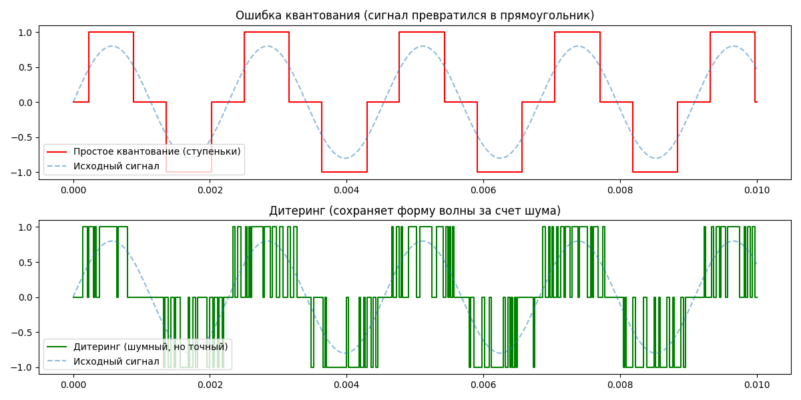

# Дитеринг

## 1. Общие положения

Дитеринг — это, пожалуй, самый контринтуитивный процесс в цифровом аудио. Казалось бы, мы боремся за чистоту сигнала, а тут нам предлагают осознанно добавить шум.

Давай разберемся, почему это спасение для звука, особенно когда мы работаем с тихими сигналами.

### Что такое ошибка квантования?
Когда мы уменьшаем разрядность сигнала (например, из 32-битной математики процессора в 16-битный формат CD), АЦП или софт вынуждены «округлять» значения амплитуды.

Если сигнал очень тихий, его амплитуда сопоставима с шагом сетки квантования. Вместо плавной волны мы получаем резкие «ступеньки». В звуке это проявляется как нелинейные искажения (гранулярный шум), которые физически неприятны на слух, так как они коррелируют с самим сигналом.

### Парадокс Дитеринга: Лечим шум шумом
**Дитеринг (Dithering)** — это процесс добавления небольшого количества специально сгенерированного случайного шума к сигналу перед тем, как его разрядность будет уменьшена.

**Как это работает:**
1. **Разрыв корреляции:** Шум заставляет значение сигнала «прыгать» между ближайшими уровнями квантования.

2. **Усреднение:** Благодаря этим прыжкам, среднее значение сигнала за несколько выборок оказывается очень близким к исходной плавной кривой.

3. **Результат:** Вместо противного цифрового треска мы слышим чистый сигнал на фоне едва заметного ровного шипения (белого шума).

**Простая аналогия:** Представь черно-белую газетную фотографию. Если использовать только черный и белый цвета (без градаций серого), изображение будет состоять из грубых пятен. Но если применить «растр» (сетку из мелких точек), наш глаз усреднит их, и мы увидим плавные переходы серого. Дитеринг — это такой же «растр», но для звука.

### Алгоритмы Noise Shaping

Просто добавить шум — это полдела. Современный дитеринг использует **Noise Shaping** (формирование шума).

Математика позволяет «вытолкать» большую часть энергии этого добавленного шума в ту область частот, где человеческое ухо наименее чувствительно (обычно выше 15–18 кГц). В итоге мы получаем динамический диапазон даже выше теоретического предела для данной разрядности, а сам шум становится практически неслышимым.

### Почему это важно для тебя (как для исследователя DSP)?

Когда ты будешь писать код для обработки сигналов на Python:

- Если ты просто обрежешь (truncate) `float64` до `int16`, ты получишь искажения на тихих хвостах реверберации или затухающих нотах.

- Правильный подход: `Output = Quantize(Signal + Dither_Noise)`.

## 2. Практика

Практика на Python — лучший способ «пощупать» математику руками. Мы создадим ситуацию, где сигнал настолько тихий, что без дитеринга он просто превращается в мусор.

Для этого нам понадобятся библиотеки, которые ты уже изучаешь: `numpy` для генерации данных и `matplotlib` для визуализации.

### Python-эксперимент: Квантование vs Дитеринг
В этом коде мы создадим тихую синусоиду и уменьшим её разрешение до очень низкого (например, до 4 бит), чтобы искажения были видны невооруженным глазом.

#### Python
```Python
import numpy as np
import matplotlib.pyplot as plt

# 1. Генерация чистого сигнала (очень тихая синусоида)
fs = 44100
t = np.linspace(0, 0.01, int(fs * 0.01))
amplitude = 0.8  # Амплитуда близка к порогу одного шага квантования
signal = amplitude * np.sin(2 * np.pi * 440 * t)

# 2. Обычное квантование (Truncation)
# Округляем до целых чисел (симулируем низкую разрядность)
quantized_simple = np.round(signal)

# 3. Квантование с Дитерингом
# Добавляем случайный шум (размером в 1 шаг квантования) ПЕРЕД округлением
dither_noise = np.random.uniform(-0.5, 0.5, len(signal))
quantized_dither = np.round(signal + dither_noise)

# Визуализация
plt.figure(figsize=(12, 6))

plt.subplot(2, 1, 1)
plt.step(t, quantized_simple, label='Простое квантование (ступеньки)', color='red')
plt.plot(t, signal, '--', label='Исходный сигнал', alpha=0.5)
plt.title("Ошибка квантования (сигнал превратился в прямоугольник)")
plt.legend()

plt.subplot(2, 1, 2)
plt.step(t, quantized_dither, label='Дитеринг (шумный, но точный)', color='green')
plt.plot(t, signal, '--', label='Исходный сигнал', alpha=0.5)
plt.title("Дитеринг (сохраняет форму волны за счет шума)")
plt.legend()

plt.tight_layout()
plt.show()
```


### Что мы здесь видим?
- На первом графике синусоида превратилась в «меандр» (прямоугольный сигнал). В звуке это звучит как жуткий металлический треск. Информации о плавной кривой больше нет.

- На втором графике сигнал выглядит «лохматым» из-за шума. Но если ты присмотришься или применишь усреднение (фильтр низких частот), ты увидишь, что средняя линия этого шума в точности повторяет нашу синусоиду.

### Почему это победа?
Наше ухо и мозг работают как мощный фильтр. Мы способны слышать чистый тон даже если он на 10-15 дБ ниже уровня шума. Дитеринг «обменивает» неприятные цифровые искажения на безобидное шипение, сохраняя при этом музыкальность и детали.