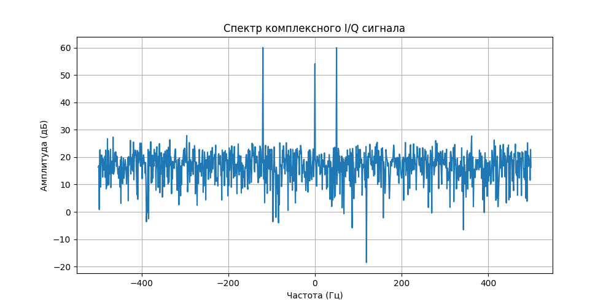

# Быстрое преобразование Фурье (для комплексного сигнала)

**БПФ (Быстрое преобразование Фурье)**— это, пожалуй, самый важный алгоритм в истории ЦОС. Без него твой ПК тратил бы вечность на простую отрисовку спектра в SDR-программе.

Если говорить просто: БПФ переводит сигнал из «языка времени» (амплитуда) на «язык частот» (спектр).

## 1. Почему «Быстрое»?

Обычное Дискретное преобразование Фурье (ДПФ) имеет сложность $O(N^2)$. Если у тебя 1024 отсчета, нужно около миллиона операций. БПФ (алгоритм Кули-Тьюки) использует симметрию и сложность падает до $O(N \log N)$. Для 1024 отсчетов это всего ~10 000 операций. Разница в **100 раз**!

## 2. Спектр I/Q сигнала (Complex FFT)

Вот здесь кроется главное отличие от обычного аудио.

 - **Для вещественного сигнала** (просто массив чисел) спектр всегда симметричен. Отрицательные частоты — это просто зеркало положительных.
- **Для комплексного сигнала** (наши I/Q данные) спектр асимметричен.

Это позволяет нам видеть, что происходит «слева» и «справа» от несущей частоты в радиоэфире отдельно.

## 3. Практика на Python: Анализируем спектр

Давай создадим сигнал, состоящий из двух частот, и увидим их на графике. Важный момент: в `numpy` результат БПФ идет от 0 до $f_s$. Чтобы получить привычный график с нулем в центре, мы используем `np.fft.fftshift`.

### Python
```Python
import numpy as np
import matplotlib.pyplot as plt

fs = 1000  # Частота дискретизации
t = np.arange(0, 1, 1/fs)

# Создаем комплексный сигнал: 50 Гц вращается "вправо", 120 Гц "влево"
# (заметь минус у второй частоты)
sig = np.exp(1j * 2 * np.pi * 50 * t) + 0.5 * np.exp(1j * 2 * np.pi * -120 * t)

# Добавим немного шума
sig += 0.2 * (np.random.randn(len(t)) + 1j * np.random.randn(len(t)))

# Вычисляем БПФ
fft_res = np.fft.fft(sig)
fft_freqs = np.fft.fftfreq(len(t), 1/fs)

# Сдвигаем, чтобы 0 Гц был в центре
fft_res_shifted = np.fft.fftshift(fft_res)
fft_freqs_shifted = np.fft.fftshift(fft_freqs)

plt.figure(figsize=(10, 5))
plt.plot(fft_freqs_shifted, 20 * np.log10(np.abs(fft_res_shifted))) # В децибелах
plt.title("Спектр комплексного I/Q сигнала")
plt.xlabel("Частота (Гц)")
plt.ylabel("Амплитуда (дБ)")
plt.grid(True)
plt.show()
```
### Результат



## 4. На что смотреть в результате?

1. Пики: Ты увидишь четкий пик на +50 Гц и пик поменьше на -120 Гц.

2. Шумовая полка: Всё, что внизу — это тот самый белый шум и шум квантования, о котором мы говорили раньше.

3. Разрешение: Чем больше точек в БПФ (N), тем точнее мы видим частоту, но тем медленнее работает алгоритм.