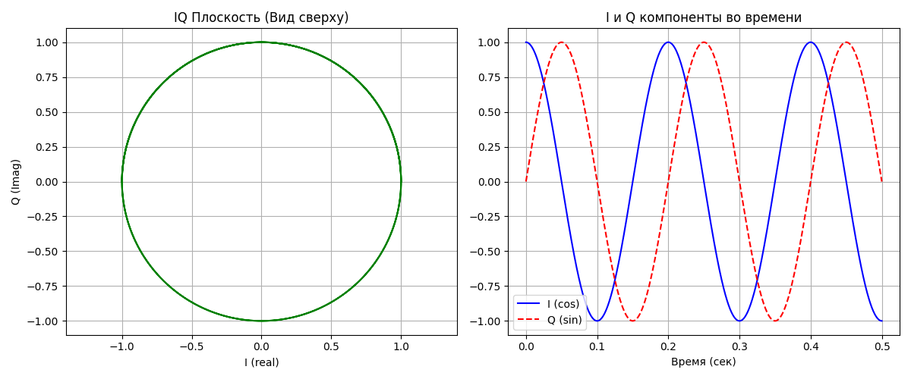

# Представление сигнала в комплексном виде - I/Q

В обычном мире мы привыкли к вещественным числам (напряжение в розетке, громкость звука). Но в радиосвязи мы почти всегда работаем с комплексными числами, или I/Q-сигналами.

## 1. Зачем они нужны? (Проблема одной фазы)
Представь, что у тебя есть датчик, который меряет только высоту грузика на пружине. Если грузик замер в верхней точке, ты не знаешь: он только что прилетел снизу или он начинает падать сверху? У тебя нет информации о направлении вращения.

В радио нам нужно различать положительные и отрицательные частоты. Обычный (вещественный) сигнал симметричен — его спектр «зеркалит» относительно нуля. Чтобы избавиться от этой избыточности и точно знать фазу сигнала в любой момент, мы используем два канала:

1. **I (In-phase)** — синфазная составляющая.
2. **Q (Quadrature)** — квадратурная составляющая (сдвинутая на 90°).

## 2. Математическая модель

В ЦОС мы представляем сигнал как вектор (фазор), который вращается на комплексной плоскости:

$$
x(t) = I(t) + j \cdot Q(t)
$$

Где $j$ — мнимая единица ($\sqrt{-1}$).
- Амплитуда (сила сигнала) = $\sqrt{I^2 + Q^2}$
- Фаза (угол поворота) = $\arctan(Q / I)$

Это позволяет нам мгновенно менять частоту или фазу сигнала, просто умножая его на другое комплексное число. Это основа всех видов модуляции (от простой FM до Wi-Fi).

## 3. Практика на Python: Создаем I/Q сигнал

Давай визуализируем, как выглядит «вращение» сигнала.
```Python
import numpy as np
import matplotlib.pyplot as plt

# Параметры
fs = 1000 # частота дискретизации
f_signal = 5 # частота сигнала 5 Гц
t = np.linspace(0, 0.5, fs) # 0.5 секунды

# создаем комплексный сигнал I - это, cos Q - это sin
# exp(j * 2 * pi * f * t) = cos(...) + j * sin(...)
iq_signal = np.exp(1j * 2 * np.pi * f_signal * t)

# Рисуем
fig = plt.figure(figsize=(12, 5))

# 1. Плоскость IQ (Комплексная плоскость)
ax1 = fig.add_subplot(121)
ax1.plot(iq_signal.real, iq_signal.imag, 'g')
ax1.set_title("IQ Плоскость (Вид сверху)")
ax1.set_xlabel("I (real)")
ax1.set_ylabel("Q (Imag)")
ax1.grid(True)
ax1.axis('equal')

# Сигнал во времени
ax2 = fig.add_subplot(122)
ax2.plot(t, iq_signal.real, label='I (cos)', color='blue')
ax2.plot(t, iq_signal.imag, label='Q (sin)', color='red', linestyle='--')
ax2.set_title("I и Q компоненты во времени")
ax2.set_xlabel("Время (сек)")
ax2.legend()
ax2.grid(True)

plt.tight_layout()
plt.show()
```


Левый график покажет нам идеальный круг. В реальности (в SDR приемнике) из-за шумов и искажений этот круг будет «размытым» или сплюснутым в эллипс — так инженеры находят проблемы в «железе».

## Разбор кода формиравания комплексного аналитического сигнала

`iq_signal = np.exp(1j * 2 * np.pi * f_signal * t)`

Эта строка кода на Python (обычно с использованием библиотеки NumPy) — это классический способ создания комплексного аналитического сигнала. В контексте радиосвязи и DSP она описывает вращающийся вектор на комплексной плоскости.

Давай разберем её по частям, используя формулу Эйлера:

$$
e^{j\theta} = \cos(\theta) + j\sin(\theta)
$$

### Анатомия выражения

В нвшем коде $\theta = 2\pi \cdot f_{signal} \cdot t$. Вот что это значит на практике:
- `np.exp(1j * ...)`: Это комплексная экспонента. Она создает сигнал, который содержит сразу и «синфазную» составляющую ($I$, косинус), и «квадратурную» ($Q$, синус).
- `2 * np.pi * f_signal`: Это угловая частота ($\omega$). Она определяет, как быстро вектор вращается вокруг центра координат.
- `t`: Массив времени. Без него сигнал был бы просто точкой, а с ним — это последовательность значений, изменяющихся во времени.

### Почему это важно для IQ-данных?

В обычном «реальном» мире мы работаем с вещественными сигналами (например, напряжение в антенне). Но в цифровой обработке удобнее использовать комплексную форму, потому что:
1. **Разделение сторон:** Она позволяет легко отличить положительные частоты от отрицательных. Вещественный косинус имеет симметричный спектр, а $e^{j\omega t}$ — пик только на одной частоте.
2. **Удобство манипуляций:** Изменение фазы или частоты сводится к простому умножению комплексных чисел.
3. **Компактность:** Весь сигнал описывается одной переменной `iq_signal`, где `real` часть — это $I$, а `imag` — это $Q$.

## Почему это важно?

Когда мы будем обрабатывать данные с SDR-приемника, библиотека (например, numpy) будет выдавать нам массив типа `complex128`.

- Все операции фильтрации будут идти над комплексными числами.
- Мы сможем делать сдвиг частоты (Frequency Shift) простым умножением на комплексную экспоненту.