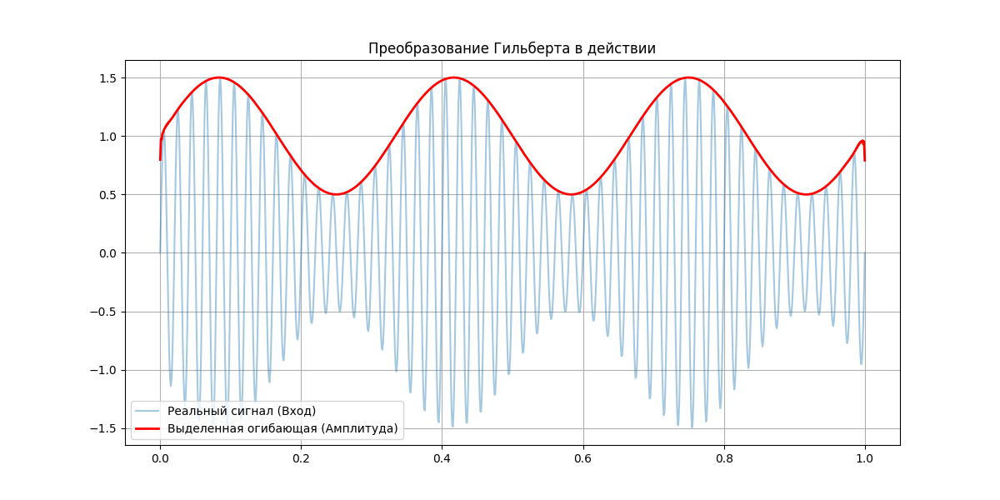

# Преобразование реального сигнала в комплексный (Преобразование Гильберта)

Преобразование Гильберта — это именно тот «мост», который позволяет превратить обычный одномерный сигнал (например, запись с микрофона или данные с одного АЦП) в полноценный комплексный I/Q сигнал.

## 1. Что оно делает физически?
Представь, что у тебя есть сигнал $x(t)$. Преобразование Гильберта создает его «тень» $\hat{x}(t)$, в которой все частотные составляющие сдвинуты по фазе ровно на **-90°**.

Когда мы объединяем оригинал и эту «тень», мы получаем **аналитический сигнал:**

$$
z(t) = x(t) + j\hat{x}(t)
$$

### Зачем это нужно в радио?

- **Удаление зеркального канала:** В спектре аналитического сигнала отсутствуют отрицательные частоты. Это экономит полосу пропускания в два раза.

- **Выделение огибающей:** Если ты хочешь узнать мгновенную амплитуду (мощность) сигнала, тебе не нужно ждать пика волны — ты можешь вычислить её в любой момент как $|z(t)| = \sqrt{x^2 + \hat{x}^2}$.

## 2. Практика на Python: Делаем из синуса I/Q

В scipy есть готовая функция hilbert, которая на самом деле возвращает сразу весь комплексный аналитический сигнал $z(t)$.

```Python
import numpy as np
import matplotlib.pyplot as plt
from scipy.signal import hilbert

# Создаем вещественный сигнал (например, АМ-модуляция)
fs = 1000
t = np.linspace(0, 1, fs)
# Несущая 50 Гц, огибающая 3 Гц
carrier = np.sin(2 * np.pi * 50 * t)
envelope = 1 + 0.5 * np.sin(2 * np.pi * 3 * t)
signal = carrier * envelope

# Применяем преобразование Гильберта
analytic_signal = hilbert(signal)
amplitude_envelope = np.abs(analytic_signal) # Огибающая
instantaneous_phase = np.unwrap(np.angle(analytic_signal)) # Мгновенная фаза

plt.figure(figsize=(12, 6))
plt.plot(t, signal, label='Реальный сигнал (Вход)', alpha=0.4)
plt.plot(t, amplitude_envelope, 'r', label='Выделенная огибающая (Амплитуда)', linewidth=2)
plt.title("Преобразование Гильберта в действии")
plt.legend()
plt.grid(True)
plt.show()
```


## 3. Где это пригодится в твоих проектах?
Если ты когда-нибудь захочешь написать свой демодулятор AM или FM на Python, преобразование Гильберта будет первым шагом:

1. **Для AM:** Берешь модуль `(np.abs)` от аналитического сигнала — это и есть твой звук/данные.

2. **Для FM:** Берешь производную от мгновенной фазы `(np.diff(np.unwrap(np.angle(...))))` — и получаешь частоту.

### Тонкий момент (Warning)

В реальности реализовать идеальный «трансформатор Гильберта» во времени невозможно (нужен бесконечный фильтр). Поэтому в цифровых схемах используют специальные **FIR-фильтры Гильберта**, которые дают небольшую задержку, но работают в реальном времени.